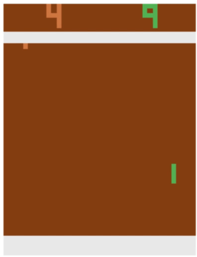
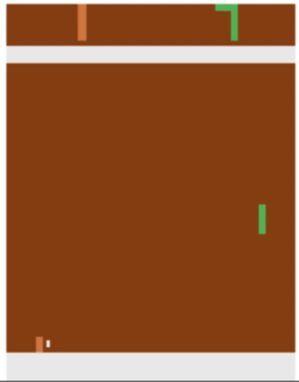
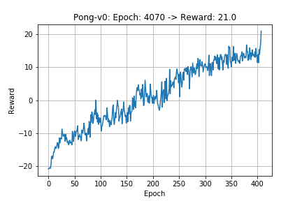

# PongAI
A pong agent built using Proximal Policy Optimization, a policy based Reinforcement Learning method

### Framework Used:
Pytorch

## Algorithm
PPO algorithm is a kind of policy gradient method for reinforcement learning, in which this kind of methods are an appealing approach because they directly optimize the cumulative reward and can straightforwardly be used with nonlinear function approximators such as neural networks. PPO alternates between sampling data through interaction with the environment, and optimizing a surrogate objective function using stochastic gradient ascent. The algorithm shown in the picture below is a generic representation of a proximal policy optimization method. Whereas standard policy gradient methods perform one gradient update per data sample, it proposes a different objective function that enables multiple epochs of mini-batch updates.

## Output and Reward 

### Output
| REINFORCE Algorithm            |  PPO Algorithm |
:-------------------------:|:-------------------------:
   |   

### Reward

## References
[1] Playing Atari with Deep Reinforcement Learning, Mnih et al. arXiv:1312.5602v1 [cs.LG] 19 Dec 2013

[2] Proximal Policy Optimization Algorithms, Schulman et al. 2017 arXiv:1707.06347v2 [cs.LG] 28 Aug 2017

